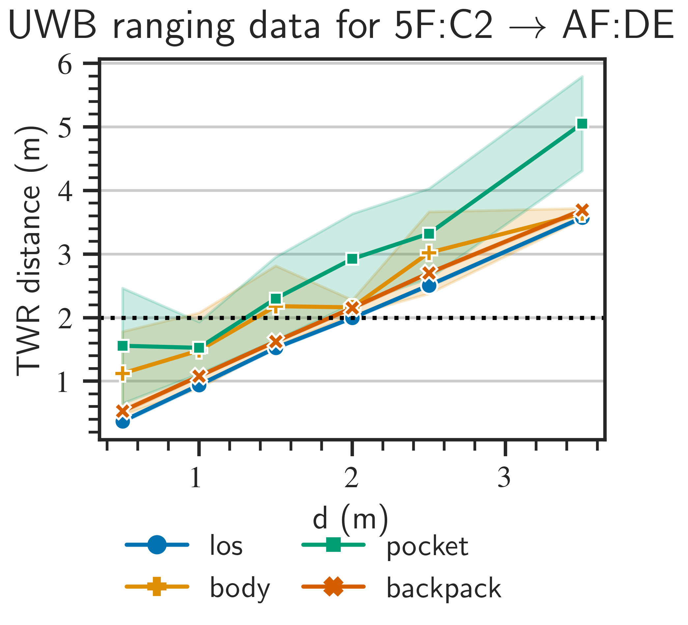
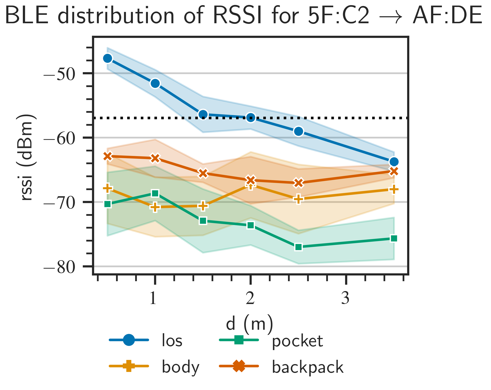
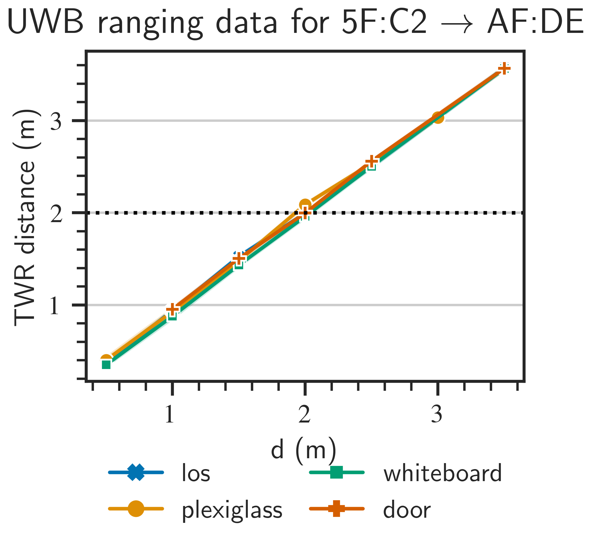
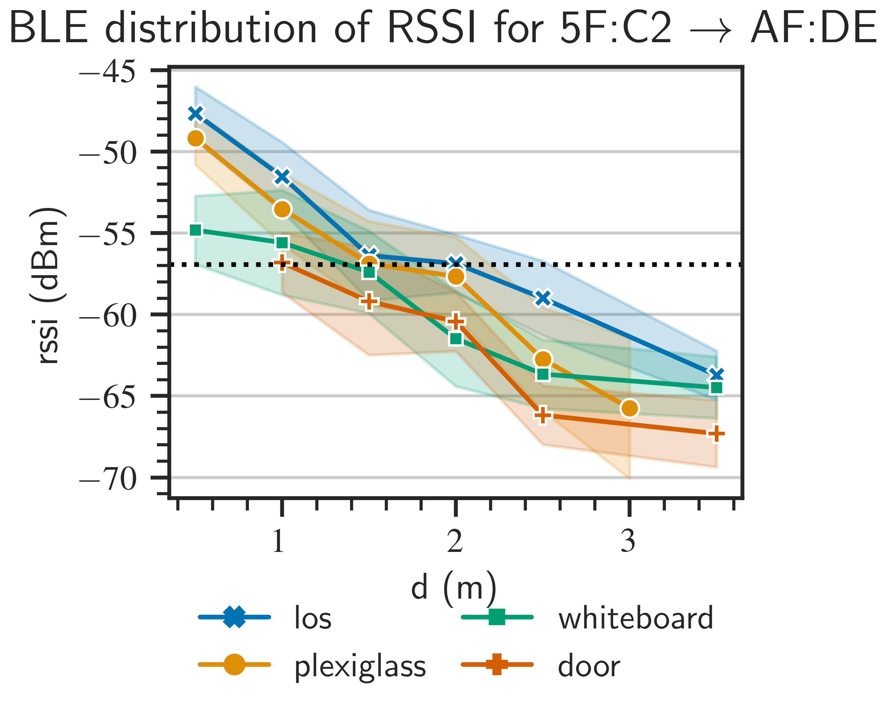

# Accuracy
[TODO] [TODO] Add brief summary

## I) Experimentation details
Testbed setup + pics

## II) Prerequisites
[TODO] 
## II.A) Embedded Application
[TODO] 
### II.B) General Workflow 
[TODO] 
## III) Exposed datasets
[TODO] Add pandas preview

| Dataset | Description |
|---------|-------------|
| [ds-one-to-one-ble.csv](./datasets/ds-one-to-one-ble.csv) | BLE RSSI proximity data |
| [ds-one-to-one-uwb.csv](./datasets/ds-one-to-one-uwb.csv) | UWB TWR ranging proximity data |
| [ds-one-to-one-pepper.csv](./datasets/ds-one-to-one-pepper.csv) | End of epoch data(for the record) |

## IV) Results

|||
|:------------------------------------------:|:------:|
|  (a) Contact Scenarios: **UWB** proximity data  | (b) Contact Scenarios: **BLE** proximity data |     
|||
|(c) No Contact Scenarios: **UWB** proximity data | (d) No Contact Scenarios: **BLE** proximity data  |     

## V) Comments
[TODO] Add comments as in paper
