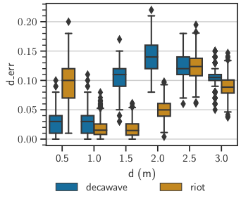

# Baseline

The experiment aims to evaluate ranging performance between two static nodes at a
fixed known distance to verify that a the fully open-source implementation achieves
the same results as the available closed-source tools we compared the performance of RIOTs
UWB support (Decawave UWB-core) via the `twr-aloha` application against Decawave DWM1001
PANS binary firmware published by the manufacturer. We also wanted to validate the
accuracy within the range distance of interest for contact-tracing applications, i.e. under 2m.

## I) Prerequisites

## II) Experimentation details

For both applications we used mode 14 channel 5 (at 6.49GHz), 6.8 Mb/s data-rate,
a PRF of 64MHz and a preamble length of 128 symbols. This configuration is suited
for short range communication under LOS conditions.

In a LOS scenario, we mount two devices on 1.5m camera tripods. The ranging data,
for each firmware selection, is captured and parsed remotely thanks to raspberry
pi boards connected to the serial devices.

## II.A) Embedded Application

For the RIOT side the target application is [twr_aloha](https://github.com/RIOT-OS/RIOT/blob/master/examples/twr_aloha/README.md)
in RIOT master.

For the Decawave side target application is [DWM1001_DWM1001-DEV_MDEK1001_Sources_and_Docs_v9.zip](https://www.decawave.com/wp-content/uploads/2019/03/DWM1001_DWM1001-DEV_MDEK1001_Sources_and_Docs_v9.zip): factory firmware available in the path `DWM1001_DWM1001-DEV_MDEK1001_Sources_and_Docs_v9./DWM1001/Factory_Firmware_Image/DWM1001_PANS_R2.0.hex` once unzipped.

### II.B) General Workflow with RIOT firmware

1. Flash the application on both devices
```shell
make -C examples/twr_aloha
```
2. Set both nodes to listen

```shell
twr lst on
```

3. Find out on of the nodes short-address

```shell
Iface  3        HWaddr: 98:9C  Channel: 5  NID: DE:CA

                Long HWaddr: 04:02:C1:88:CA:E2:98:9C
                TX-Power: 9.5dBm  TC-PGdelay: 0xc5
```

4. Of the other node start ranging with 100ms intervals 500 times

```shell
 twr req 98:9C -c 500 -i 100
twr req 98:9C -c 500 -i 100
[twr]: start ranging
{"t": 20161, "src": "02:A1", "dst": "98:9C", "d_cm": 430}
{"t": 20261, "src": "02:A1", "dst": "98:9C", "d_cm": 475}
...
```

### II.C) General Workflow with Decawave firmware
1. Flash the hex on both devices using Jlink Flash Lite or by command line
```shell
$ JLinkExe 
J-Link> si 1
J-Link> device nrf52832_XXAA
J-Link> speed 1000
J-Link> erase
J-Link> r
J-Link> h
J-Link> sleep 200
J-Link> loadfile DWM1001_PANS_R2.0.hex
J-Link> sleep 200
J-Link> r
J-Link> q
```
:warning: In order to enter shell mode, you must hit `enter` twice to get prompted with `dwm>`.

2. Find out on of the nodes short-address by typing the `si` command and checking the field in the form `addr=xDECAxxxxxxxxxxxx` where the last `xxxx` are the short address. In the output below, we have `0x1512`short address. This address also appears (by default) in the field `label=DW1512`.

```shell
@
 DWM1001 TWR Real Time Location System

 Copyright :  2016-2019 LEAPS and Decawave
 License   :  Please visit https://decawave.com/dwm1001_license
 Compiled  :  Mar 27 2019 03:35:59

 Help      :  ? or help

dwm> si
[000044.950 INF] sys: fw2 fw_ver=x01030001 cfg_ver=x00010700
[000044.950 INF] uwb0: panid=xBACA addr=xDECADDF048951512
[000044.960 INF] mode: tn (off,twr,np,le)
[000044.960 INF] uwbmac: disconnected
[000044.960 INF] uwbmac: bh disconnected
[000044.970 INF] cfg: sync=0 fwup=0 ble=1 leds=1 le=1 lp=0 stat_det=0 mode=0 upd_rate_norm=1 upd_rate_stat=1 label=DW1512
[000044.980 INF] enc: off
[000044.980 INF] ble: addr=FA:8B:AA:61:4E:0A
dwm> 
```

3. Configure PAN initiator node with `pan_id=0xCAFE`

```shell
dwm> nis 0xCAFE
dwm> nmi 
```

4. Of the other node, configure it as tag on the same `pan_id`, then start ranging with `100ms` intervals  using the `les` command

```shell
dwm> nis 0xCAFE
dwm> acts 0 0 0 1 0 1 1 2 0
dwm> aurs 10 10
dwm> reset
dwm> les
```
:warning: When you send the `reset` command, you leave shell mode and must type `enter` twice then the `les` command to log TWR ranging results
:warning: To stop ranging, hit `enter` (i.e repeat last command here `les`) or simply send `les`

## IV) Exposed datasets

This section provides an overview of the [datasets](./datasets)

| Dataset | Description |
|---------|-------------|
| [ds-baseline.csv](./datasets/ds-baseline.csv) | TWR ranging captures |

Dataset content preview:
```python
>>> import pandas as pd
>>> data = pd.read_
>>> data = pd.read_csv('ds-baseline.csv', index_col=0)
>>> data.head(2)
   env method orientation    d    src    nei     d_est  d_err_absolute  d_err_relative
0  los   riot       front  1.0  C3:29  57:81  0.972347        0.027653        0.027653
1  los   riot       front  1.0  C3:29  57:81  0.991523        0.008477        0.008477
>>> data.info()
<class 'pandas.core.frame.DataFrame'>
Int64Index: 17927 entries, 0 to 17926
Data columns (total 9 columns):
 #   Column          Non-Null Count  Dtype  
---  ------          --------------  -----  
 0   env             17927 non-null  object 
 1   method          17927 non-null  object 
 2   orientation     17927 non-null  object 
 3   d               17927 non-null  float64
 4   src             17927 non-null  object 
 5   nei             17927 non-null  object 
 6   d_est           17927 non-null  float64
 7   d_err_absolute  17927 non-null  float64
 8   d_err_relative  17927 non-null  float64
dtypes: float64(4), object(5)
memory usage: 1.4+ MB
````
The column `method` facilitates analyzing data from riot or Decawave independently.

## V) Results

Results in below show that the ranging accuracy with RIOT is close to the
reference accuracy with the constructor's firmware.

||
|:-------------------------------------------------------------------------------:|
|                          *Distance error*                           |

||
|:-------------------------------------------------------------------------------:|
|                          *Distance error (orientation)*                           |
