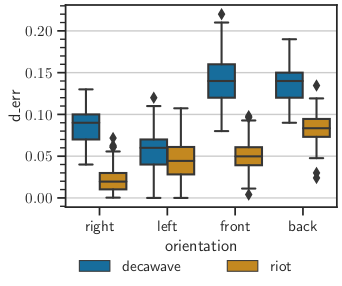

# Baseline

The experiment aims to evaluate ranging performance between two static nodes at a
fixed known distance to verify that a the fully open-source implementation achieves
the same results as the available closed-source tools we compared the performance of RIOTs
UWB support (Decawave UWB-core) via the `twr-aloha` application against Decawave DWM1001
PANS binary firmware published by the manufacturer. We also wanted to validate the
accuracy within the range distance of interest for contact-tracing applications, i.e. under 2m.

## I) Prerequisites

## II) Experimentation details

For both applications we used mode 14 channel 5 (at 6.49GHz), 6.8 Mb/s data-rate,
a PRF of 64MHz and a preamble length of 128 symbols. This configuration is suited
for short range communication under LOS conditions.

In a LOS scenario, we mount two devices on 1.5m camera tripods. The ranging data,
for each firmware selection, is captured and parsed remotely thanks to raspberry
pi boards connected to the serial devices.

## II.A) Embedded Application

For the RIOT side the target application is [twr_aloha](https://github.com/RIOT-OS/RIOT/blob/master/examples/twr_aloha/README.md)
in RIOT master.

### II.B) General Workflow

1. Flash the application on both devices
```shell
make -C examples/twr_aloha
```
2. Set both nodes to listen

```shell
twr lst on
```

3. Find out on of the nodes short-address

```shell
Iface  3        HWaddr: 98:9C  Channel: 5  NID: DE:CA

                Long HWaddr: 04:02:C1:88:CA:E2:98:9C
                TX-Power: 9.5dBm  TC-PGdelay: 0xc5
```

4. Of the other node start ranging with 100ms intervals 500 times

```shell
 twr req 98:9C -c 500 -i 100
twr req 98:9C -c 500 -i 100
[twr]: start ranging
{"t": 20161, "src": "02:A1", "dst": "98:9C", "d_cm": 430}
{"t": 20261, "src": "02:A1", "dst": "98:9C", "d_cm": 475}
...
```

## IV) Exposed datasets

This section provides an overview of the [datasets](./datasets)

| Dataset | Description |
|---------|-------------|
| [ds-baseline.csv](./datasets/ds-baseline.csv) | TWR ranging captures |

## V) Results

Results in below show that the ranging accuracy with RIOT is close to the
reference accuracy with the constructor's firmware.

||
|:-------------------------------------------------------------------------------:|
|                          *Distance error*                           |

||
|:-------------------------------------------------------------------------------:|
|                          *Distance error (orientation)*                           |
