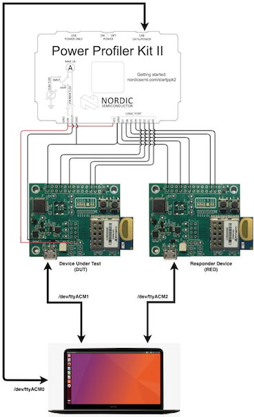
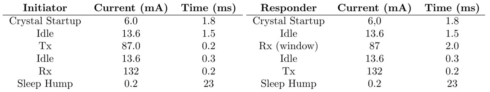
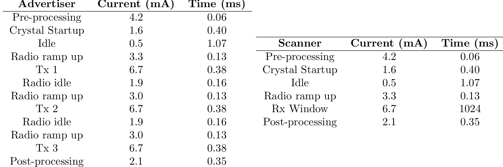
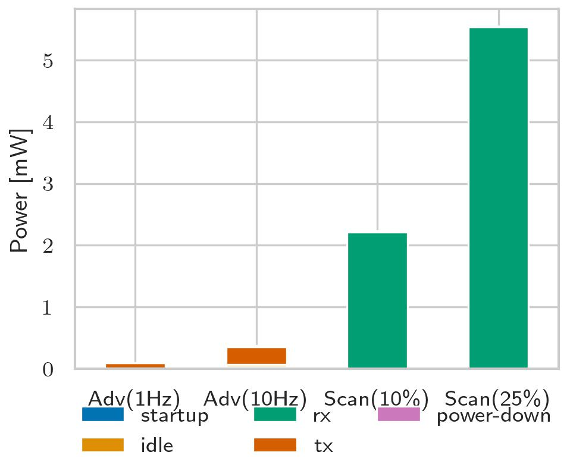
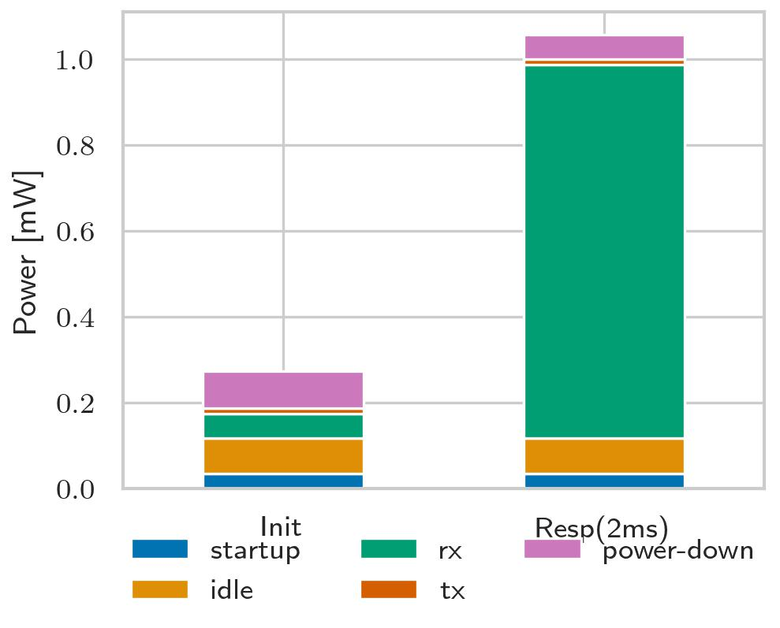
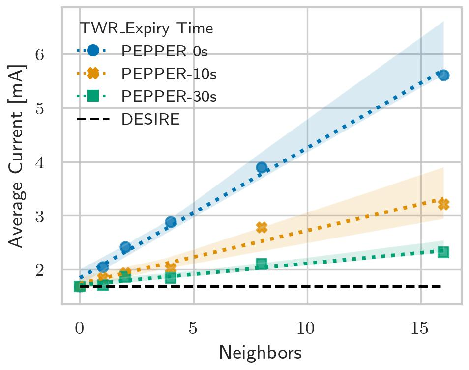

# Power Consumption

This experiment evaluates the PoC average current consumption. It's measured in
scenarios with different amount of neighbors and with varying TWR back-off.

- neighbors: dwm1001 devices that close enough for the DUT to schedule TWR exchanges with
- TWR expiry time: time to wait after a successful TWR exchange before attempting a new one exchange.

## I) Prerequisites

- A [Nordic Power Profiler Kit II](https://eu.mouser.com/new/nordic-semiconductor/nordic-power-profiler-kit-2/?gclid=CjwKCAjwjtOTBhAvEiwASG4bCOO0BagGPWE2MuKZrlsp4m0DwB_qc-KmdqWzsTgIOwCwJvqT2jyBjRoCvdgQAvD_BwE)

- Install [nrfconnect](https://www.nordicsemi.com/Products/Development-tools/nrf-connect-for-desktop/download)
to access nordic power profiler application.

## I.A) Device Under Test Setup

DUT: the devices under test is connected to a [Nordic Power Profiler Kit II](https://eu.mouser.com/new/nordic-semiconductor/nordic-power-profiler-kit-2/?gclid=CjwKCAjwjtOTBhAvEiwASG4bCOO0BagGPWE2MuKZrlsp4m0DwB_qc-KmdqWzsTgIOwCwJvqT2jyBjRoCvdgQAvD_BwE)

The DUT current is measured through JP2 (see dwm1001-dev data sheet). J3, J5, J4
are desoldered. J16 is not, therefore the J-Link is powered but as current is measured
in J4 the J-Link current supply is not measured.

The DUT was deployed in IoT-LAB Lille, which has 14 dwm1001-dev boards available,
2 mores where locally added to reach 16 neighbors.
The picture below illustrates a local power profiling testbed wiring.

Note that the PPKII has a logic port exposing 8 GPIOs (`D0 -> D7`) that are connected to the DWM1001-dev J10 header (RPI-compatible) of each board.
Indeed, for debugging purposes, we used such GPIOs to track internal firmware states (transmitting, receiving, broadcasting, etc) with the following pinout:

| Signal | Board    | J10 Header     | DWM1001        | NRF52832 pin |
|--------|-----------|----------------|----------------|--------------|
| D0     | DUT       | SDA RPI (3)    | GPIO_15 (23)   | P0.15        |
| D1     | DUT       | SCL RPI (5)    | GPIO_8 (25)    | P0.8         |
| D2     | DUT       | GPIO RPI (15)  | READY (19)     | P0.26        |
| D3     | DUT       | SPI1_MOSI (19) | SPIS_MOSI (27) | P0.6         |
| D4     | Responder | SDA RPI (3)    | GPIO_15 (23)   | P0.15        |
| D5     | Responder | SCL RPI (5)    | GPIO_8 (25)    | P0.8         |
| D6     | Responder | GPIO RPI (15)  | READY (19)     | P0.26        |
| D7     | Responder | SPI1_MOSI (19) | SPIS_MOSI (27) | P0.6         |


## II) Experimentation details

By default, the application will use default DESIRE+PEPPER parameters:

- Advertisement per EBID slice: 20
- Epoch duration: 900s
- Advertisement interval: 1000ms
- Scan window: 1280 ms
- Scan interval: 5120 ms
- UWB listen window: 2ms
- Iterations: forever (0)

or in c...

```c
    pepper_start_params_t params = {
        .epoch_duration_s = 900,
        .epoch_iterations = 0,
        .adv_itvl_ms = 1000,
        .advs_per_slice = 20,
        .scan_win_ms = 1280,
        .scan_itvl_ms = 5120,
        .align = false,
    };
    pepper_start(&params);
```

## II.A) Embedded Application

This test uses the [pepper_pm](https://gitlab.inria.fr/pepper/riot-desire/-/tree/develop/apps/pepper_pm)
application. Refer to the application's `README` for more details.

### II.B) General Workflow

1. Start nordic power profiler application
2. Flash all neighbors + DUT
```shell
$ make -C apps/pepper_pm flash
```
3. On the target devices (DUT + n Neighbors): start pepper for a single iteration.
```shell
pepper start -d 300 -c 1 -r 10 -s 1280,5120
```
1. Wait 1 min so devices discover each other
1. On nrfconnect begin sampling for at least 120s and with the maximum sampling
rate.
1. Register the average current consumption, export the dataset either as a `.csv`
or `.ppk`
1. Repeat steps 3-6 as needed

## III) Numeric estimations

The values for the numerical estimates are taken from the manufacturer tools as well
as datasheets:

- dw1001 (UWB): https://decaforum.decawave.com/t/dwm1001-battery-lifetime-estimator/4244
- nrf52832 (BLE): https://devzone.nordicsemi.com/power/w/opp/2/online-power-profiler-for-bluetooth-le

Summary tables are shown below for the ideal numerical estimates:

Power Consumption UWB details:


Power Consumption BLE details:


Considering default DESIRE+PEPPER parameters, therefore a 2ms receive window we observe the critical components to optimize.

||
|:--------------------------------------------------------------------:|
|     *BLE Scanner vs Advertiset Avg. Current*                        |

||
|:--------------------------------------------------------------------:|
|     *UWB Responder vs Initiator Avg. Current*                        |

## IV) Exposed datasets

This section provides an overview of the [datasets](./datasets)

| Dataset | Description |
|---------|-------------|
| [pepper_pm_ppk.zip](./datasets/pepper_pm_ppk.zip) | Nordic PPK2 captures exported as `.ppk` in the form `data_los_<neighbors>_<expiry-time>`|
| [pepper_pm.csv](./datasets/pepper_pm.csv) | CSV with average current draw, extracted from [pepper_pm_ppk.zip](./datasets/pepper_pm_ppk.zip)|
| [uwb_pm.csv](./datasets/uwb_pm.csv) | CSV with UWB power consumption profile, based on numeric estimations|
| [ble_pm.csv](./datasets/ble_pm.csv) | CSV with BLE power consumption profile, based on numeric estimations|

## IV.A) Average Current Draw

The [pepper_pm.csv](./datasets/pepper_pm.csv) dataset ca be plotted as:

```python
python plot.py
```



## V) Comments

* The lowest measured current is around `400uA`, this is good enough to get an
idea of the overall current draw, for more accurate measurements the shell should
not be used and the J-Link should be completely disconnected.
* The PPK2 kit shows currents spikes when there are high current deltas, this comes
from switching the shunt resistor load according the current draw. This yields
higher valuers than whats is expected theoretically.
* Currently the dwm1001 sleep logic is not optimized as it could be. The state
machine does not keep track of the required radio state for the next wakeUp before
putting the radio to sleep, this leads to increased wakeUp times of 6ms (drawing
around 15mA during time), this can be optimized.
* TWR back-off time is around 500us, but it could theoretically be shortened to
200us.
* Differences between numerical calculations and experimental ones also come from
the fact that OS delays in the NimBLE and UWB state machine can introduce in delays
which result in missed 'rendez-vous', this is not deterministic and increases the
observed consumption.
* As the scan window is ~25% (1.25s/5s) this can mean that up to 4 TWR requests
are missed before a scanned advertisements triggers the responder to open a UWB
receiving window, which also increases the observed consumption, this is also
non-deterministic and varies from 0-4 missed requests per successful exchange.
