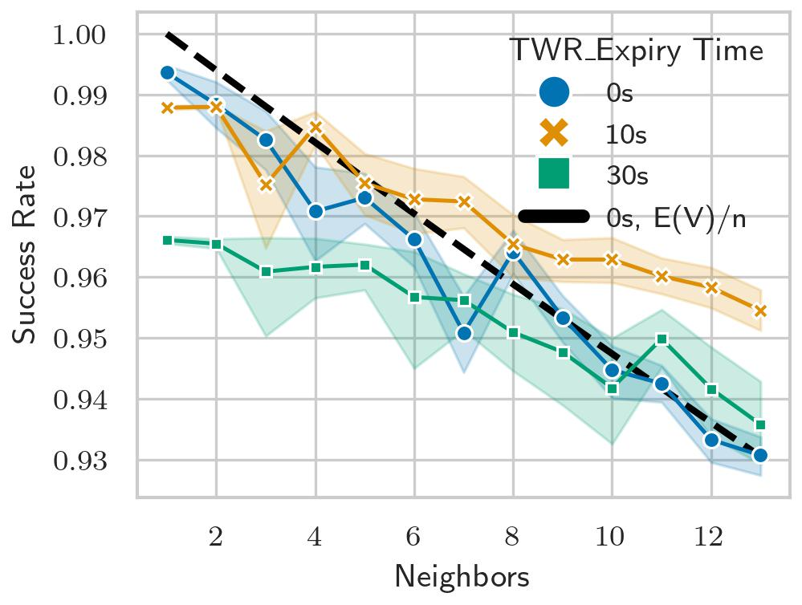

# Scalability

This experiment wants to evaluate the PoC performance as network congestion increases.
To do so it logs the results of a single EPOCH for a defined set of devices. It the
repeats this for different TWR expiry values. The experiment wants to verify two
things:

- the PoC can handled a relatively large amount of neighbors (+10)
- performance does not decrease with the use of a TWR expiry time

## I) Prerequisites

See [IoT-LAB requirements](../../README.md).

## II) Experimentation details

By default the application will use default DESIRE+PEPPER parameters:

- Advertisement per EBID slice: 20
- Epoch duration: 900s
- Advertisement interval: 1000ms
- Scan window: 1280 ms
- Scan interval: 5120 ms
- UWB listen window: 2ms
- Iterations: forever (0)

or in c...

```c
    pepper_start_params_t params = {
        .epoch_duration_s = 900,
        .epoch_iterations = 0,
        .adv_itvl_ms = 1000,
        .advs_per_slice = 20,
        .scan_win_ms = 1280,
        .scan_itvl_ms = 5120,
        .align = false,
    };
    pepper_start(&params);
```

## II.A) Embedded Application

This test uses the [pepper_iotlab](https://anonymous.4open.science/r/EWSN-pepper-D6AD/apps/pepper_iotlab)
application, see the [README.md](https://anonymous.4open.science/r/EWSN-pepper-D6AD/apps/pepper_iotlab/README.md) for more details. This application enables a module to log TWR missed encounters, which will be used to calculate a TWR exchange success rate.

### II.B) General Workflow

1. Book an IoT-LAB experiment for all available nodes
```shell
iotlab-experiment submit -n "ewsn2022" -d 60 -l 14,archi=dwm1001:dw1000+site=lille
```

2. Wait for the experiment to be in the Running state:

```shell
$ iotlab-experiment wait --timeout 30 --cancel-on-timeout
```

3. Compile the application
```
make -C apps/pepper_iotlab
```

4. Flash all nodes

```
iotlab-node --flash <PATH_TO_APPS>/apps/pepper_iotlab/bin/dwm1001/pepper_iotlab.elf -i <exp_id>
```

Alternatively flash all nodes individually, first get the nodes list

```shell
$ iotlab-experiment  --jmespath="items[*].network_address | sort(@)" get --nodes
[
    "dwm1001-1.lille.iot-lab.info",
    ...
]
```

When flashing the devices set `IOTLAB_NODE` to one of the above values, e.g. for
the firs node: `IOTLAB_NODE=dwm1001-1.lille.iot-lab.info`.

```
IOTLAB_NODE=dwm1001-1.lille.iot-lab.info make -C apps/pepper_iotlab flash
```

5. For a set a of nodes (start with 2) start pepper for a single iteration:

```shell
pepper start
```

At the end of the epoch contact data with TWR exchange metrics for each contact will be logged over serial.

6. Repeat step 13 times, adding one more neighbor on each iteration.

## III) Exposed datasets

This section provides an overview of the [datasets](./datasets)

| Dataset | Description |
|---------|-------------|
| [ds-scale.csv](./datasets/ds-scale) | CSV wit contact data for every IoT-LAB device under test, across the different configurations|

## III.A) TWR rendez-vous success rate

For the rendez-vous success rate we look only at the responder side. This because
since devices are scanning only a fraction of the time (25%), many advertisements
are missed, so will on average be 25%, but as a TWR request timeouts early, we
are concerned with how many times a RX window is opened for no TWR request to arrive.

The [ds-scale.csv](./datasets/ds-scale.csv) dataset ca be plotted with.

```python
python plot.py
```


